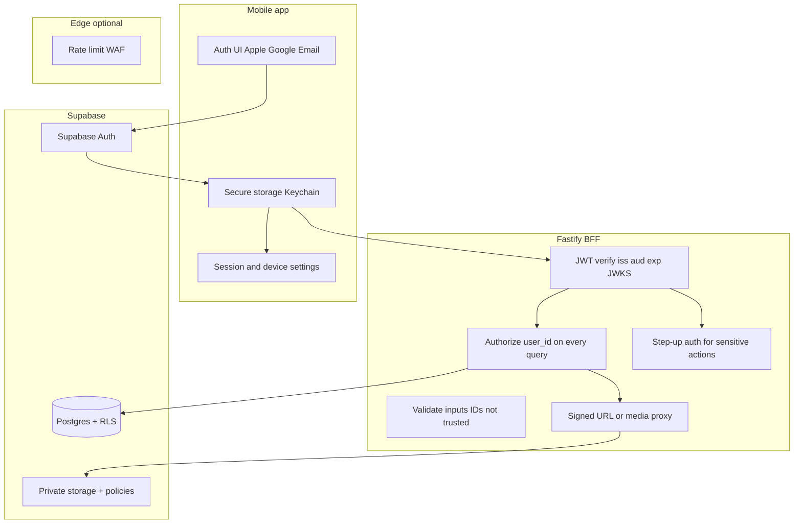

# Airtight authentication and RLS — revised plan (RecipeJar)

## North star

**Airtight security and authentication** means: (1) every action is attributable to a verified identity, (2) users can only read or mutate **their** data, including private media, (3) secrets that could impersonate the system or bypass policy never reach the client, (4) failures default **closed** (deny access, avoid leaking whether a resource exists), (5) **defense in depth** — no single layer is treated as sufficient, and (6) session, recovery, and operator paths are treated as part of the security boundary, not follow-up polish.

This plan stays aligned with [README.md](../README.md) (monorepo, Fastify + Drizzle + Supabase Postgres/Storage, MVP scope) and [ROADMAP.md](../ROADMAP.md) **Phase 0.1** (Supabase Auth, `user_id`, RLS, JWT middleware, mobile auth screens, seed-user migration) and **0.2** (privacy labels, privacy policy — auth changes what you must declare).

---

## Current baseline (facts, not assumptions)

| Fact | Source |
|------|--------|
| Three workspaces: `shared/`, `server/`, `mobile/` | README |
| DB access: Drizzle + `postgres` via `DATABASE_URL` to Supabase-hosted Postgres | README, [server/src/persistence/db.ts](../server/src/persistence/db.ts) |
| No `user_id` on domain tables today | [server/src/persistence/schema.ts](../server/src/persistence/schema.ts) |
| Supabase JS client on server uses **service role** only, for **Storage** | [server/src/services/supabase.ts](../server/src/services/supabase.ts) |
| Draft and recipe image buckets are currently **public** | README, [server/src/services/recipe-image.service.ts](../server/src/services/recipe-image.service.ts) |
| Mobile API calls have **no** `Authorization` header | [mobile/src/services/api.ts](../mobile/src/services/api.ts) |
| ROADMAP 0.1 lists email/password + Apple + Google, profiles table, RLS, JWT on Fastify | [ROADMAP.md](../ROADMAP.md) |

**Explicit non-assumption:** Whether the pooler DB role **bypasses RLS** must be verified against your Supabase project (role attributes). The plan assumes you will **verify** during implementation and document the result. Security design does not depend on RLS being the *only* line of defense for Fastify.

---

## Full authentication surface from day one (provider scope)

**Deliver in the first auth milestone** (single coherent release, not “email first then social later”):

| Category | Provider | Notes |
|----------|----------|--------|
| Email | **Password** + **Magic link** (if enabled in Supabase) | Password: rate-limit friendly flows, reset email; magic link: no password storage, phishing-aware UX |
| Apple | **Sign in with Apple** | Expected on iOS; ROADMAP references `app.recipejar.ios`; required if you offer other third-party login per Apple guidelines |
| Google | **Google OAuth** | Common user expectation; configure OAuth client IDs (iOS + Web as needed for Supabase) |

**Other “standard” providers** (GitHub, Facebook, Microsoft, etc.): Supabase supports them, but each adds **OAuth client maintenance**, **redirect URI surface**, and **support burden**. Recommendation: **ship Apple + Google + email first**; add more providers only with a product reason, and document each in a short “provider register” (client IDs, redirect URLs, owners). If you still want a fourth provider at launch, pick **one** with clear user demand rather than enabling many by default.

**Hardening options (SaaS norm, plan explicitly):**

- **Email verification** before treating email accounts as “trusted” for sensitive actions (or before sync/export if you add it later).
- **MFA / TOTP + backup codes** are part of the target design, not a hand-wavy optional. If not in the first auth PR, explicitly schedule them in **0.1.x / early 0.2** with no sensitive-account features shipping ahead of the recovery story.
- **Passkeys / WebAuthn** are the preferred longer-term phishing-resistant factor. Supabase does not make this a turnkey first-party path today, so document it as a follow-on milestone with a concrete integration approach rather than pretending it is already handled.
- **Bot / abuse:** Supabase + edge rate limits; define per-route thresholds and CAPTCHA escalation criteria up front instead of “add later if abused.”

---

## Row Level Security (RLS) — what it is and why it exists

### Mechanics (Postgres)

1. **`ALTER TABLE ... ENABLE ROW LEVEL SECURITY`** turns on filtering for the table (for roles that are subject to RLS — not superuser/BYPASSRLS).
2. **Policies** are SQL predicates:
   - **`USING`** — which existing rows are visible for `SELECT` / `UPDATE` / `DELETE`.
   - **`WITH CHECK`** — which new/changed rows are allowed for `INSERT` / `UPDATE`.
3. Typical pattern for user-owned rows: `user_id = auth.uid()` where **`auth.uid()`** is Supabase’s function returning the UUID from the JWT `sub` when the request is executed **as** the Supabase **`authenticated`** role (e.g. PostgREST, Realtime, or a session configured with JWT claims).

### Mental model for RecipeJar

Think of **two doors** into the same Postgres data:

| Door | Who | RLS applies? | Your responsibility |
|------|-----|----------------|---------------------|
| **A — Fastify + Drizzle** | Server process using `DATABASE_URL` | **Depends on DB role** (often bypasses RLS) | **Always** filter by `user_id` from **verified** JWT in application code |
| **B — Supabase Data API / Realtime / future clients** | `anon` / `authenticated` keys | **Yes** (if RLS enabled) | Policies must be correct or data leaks |

**North star interpretation:** RLS is **not a substitute** for Fastify checks when the server uses a privileged connection. RLS **is** required so **Door B** never exposes all rows, and so a **mistake** (accidentally exposing PostgREST, wrong key, new feature) does not become a **full database breach**. That is **defense in depth**.

### Storage RLS

Supabase **Storage** uses table **`storage.objects`** with its **own** RLS. **Service role bypasses** Storage RLS. So:

- **Private-by-default media is a requirement.** User-owned recipe photos and draft pages must not live in globally public buckets once auth ships. The current MVP public-bucket model is acceptable only as a pre-auth stopgap and must be explicitly unwound during the auth rollout.
- If **only the server** uploads with service role: **path rules + JWT checks in Fastify** are mandatory (`…/userId/...` and reject mismatches), and reads should be delivered via **signed URLs with short TTL** or an authenticated media proxy.
- If the **client** ever uploads with **anon + user JWT**: Storage policies must enforce `auth.uid()`-aligned paths, and the bucket must remain private.
- If you later add recipe sharing: create a **separate public-share surface** (share token, shared-copy table, or separately published asset path). Do **not** make the primary tenant bucket public just to support sharing.

### “Check your work” on RLS

After policies exist: confirm behavior under (1) **authenticated** role with a test JWT, (2) **anon** role (should not see private data), (3) **service role** (still bypass — document that this is why server-side authorization must remain strict).

---

## Layered security architecture (recommended)

1. **Transport:** TLS everywhere (production API `api.recipejar.app`, Supabase endpoints).
2. **Identity:** Supabase Auth for Apple / Google / email; use **platform-native** flows (e.g. Apple on iOS).
3. **Tokens on device:** Access token for API calls; refresh token stored in **Keychain** (or library that uses it); never log tokens; avoid putting tokens in URLs or deep links query strings where possible.
4. **Fastify:** Verify JWT (**signature** via JWKS, **issuer**, **audience** if you restrict it, **expiry**, clock skew tolerance); reject unsigned / wrong-alg tokens; attach `userId`; **require auth on all non-public routes** (including health policy if you want split public/operator health).
5. **Authorization (IDOR prevention):** Never trust client-supplied `user_id`. Use only `userId` from JWT. For `GET /recipes/:id`, resolve recipe **and** `user_id` match; use **404** for cross-user (or 403 — pick one policy and apply consistently to avoid enumeration tradeoffs).
6. **Database:** `user_id` columns + indexes + FKs; **RLS** policies on all tenant tables; optional long-term hardening: dedicated **non-bypass** DB role for app queries + `request.jwt.claims` (advanced — only after measuring need).
7. **Storage:** Private buckets, user-scoped paths, and server-validated identity ↔ path mapping. Reads come from short-lived signed URLs or an authenticated media endpoint, not permanent public URLs.
8. **Sessions:** Short-lived access tokens, refresh-token rotation with reuse detection, inactivity timeout, explicit session revocation on password/email/MFA changes, and user-visible active-session management.
9. **Secrets:** `SUPABASE_SERVICE_ROLE_KEY` and DB password only in server env / secret manager; **rotate** if leaked; separate dev/staging/prod projects or keys where feasible.
10. **Observability:** Log **auth failures**, **session lifecycle events**, and **anomalies** without logging emails/tokens in production; notify users about high-value account events.
11. **Compliance-facing:** ROADMAP **0.2** privacy policy text must mention account data, recipe content, images, auth providers; App Store **Sign in with Apple** if other social logins exist.

---

## Session lifecycle and device management (required)

The plan must define **how a session begins, refreshes, ages out, and dies**. “Bearer + refresh handling” is not specific enough for a security-critical system.

| Control | Required behavior |
|---------|-------------------|
| **Access token TTL** | Keep access JWTs short-lived (for example, **5-15 minutes**). Treat them as bearer credentials that are expected to expire frequently. |
| **Refresh rotation** | Use Supabase session refresh as **single-use rotating refresh tokens**. Treat refresh-token reuse as suspicious; revoke the affected session family and force sign-in. |
| **Inactivity timeout** | Set a server-backed inactivity/session lifetime for long-lived mobile sessions. “Stay signed in forever” is not acceptable for an airtight design. |
| **Absolute session lifetime** | Define a maximum lifetime after which reauthentication is required even if the app has been active. |
| **Single-device vs multi-device** | Decide explicitly whether multiple devices are allowed. If yes, expose a session list. If no, document “new login revokes prior sessions.” |
| **User session management** | Provide “sign out this device” and **“sign out all devices”**. The latter must revoke refresh capability server-side, not just clear local state. |
| **Security-triggered revocation** | Revoke or step up sessions after password reset, email change, MFA enrollment/removal, suspected compromise, or provider unlinking. |
| **Session visibility** | Show users at least device/platform, created-at, last-seen, and current-device markers for active sessions. |

**Implementation note for RecipeJar:** Because the mobile app talks to Fastify with bearer tokens, the API layer should enforce revocation-sensitive actions based on current session state, not only the JWT signature. Stateless acceptance of any unexpired token is too weak for logout-all, compromise response, and sensitive-account changes.

---

## Sensitive-action reauthentication (step-up)

Best-in-class SaaS apps do **not** treat an old unlocked session as enough for destructive or security-critical changes. Require **recent reauthentication** (for example, within the last **10 minutes**) using the strongest available factor before:

- Account deletion
- Data export
- Email change
- Password change
- MFA enrollment, removal, or recovery-code regeneration
- Provider linking or unlinking
- Subscription or billing owner changes if those are added later

If the user has MFA enrolled, the reverification flow should prefer the **strongest configured factor**. Do not allow recovery or identity-change paths to silently downgrade assurance.

---

## Recovery, identity changes, and provider linking

### Password reset and account recovery

- Reset tokens/codes must be **single-use**, **time-limited**, and generated by the provider using secure randomness.
- Password reset requests must return **uniform responses** whether or not an account exists.
- Rate-limit reset initiation by **IP**, **device**, and **account/email target**.
- After password reset, revoke existing sessions or force a new sign-in everywhere except where you have a deliberate, documented exception.
- Send a **non-secret confirmation email** after reset succeeds.

### Email change

- Require **recent reauthentication** before starting an email change.
- Notify the **old email address** that a change was requested/completed.
- Require confirmation of the **new email address** before it becomes primary.
- Treat email change as a security event that can revoke or step up other sessions.

### MFA recovery

- If MFA is enabled, provide **backup recovery codes** at enrollment time and regeneration flow under step-up auth.
- Document what happens if the user loses both the authenticator and the signed-in device.
- Do not let password reset become an MFA bypass without an explicit recovery design.

### Provider linking and duplicate-account prevention

- Pick an explicit Supabase identity-linking strategy: **automatic same-email linking** or **manual linking only after sign-in**.
- Test collision flows such as “password account first, then Apple private relay,” “Google first, then Apple with same visible email,” and “provider returns unverified email.”
- Define which providers may create accounts versus only link to existing accounts.
- On unlink, ensure the account still has at least one viable login/recovery method.

---

## Password and authenticator standards

- Support **password managers** and paste/autofill without hostile UX restrictions.
- Use a modern minimum password length (for example **>= 12** unless the upstream auth provider dictates otherwise).
- Screen new passwords against **known-breached password** lists if the chosen auth stack allows it operationally.
- Avoid arbitrary composition rules and periodic forced password rotation without evidence of compromise.
- Document the target authenticator posture:
  - **Launch target:** Password, magic link, Apple, Google
  - **Near-term hardening:** TOTP MFA + backup codes
  - **Phishing-resistant roadmap:** Passkeys / WebAuthn once integration is ready

---

## Abuse controls (required matrix)

Replace the current generic abuse bullet with an explicit matrix:

| Surface | Primary control | Secondary control | Notes |
|---------|-----------------|-------------------|-------|
| **Signup** | Per-IP + per-email rate limit | CAPTCHA escalation | Trigger CAPTCHA after repeated attempts or abnormal velocity |
| **Password login** | Per-account + per-IP throttling | Temporary cool-down / challenge | Avoid permanent lockout as an attacker tool |
| **Magic link / OTP send** | Per-email + per-device throttling | CAPTCHA escalation | Prevent email flooding |
| **Password reset request** | Per-account + per-IP throttling | Uniform responses | No existence leak |
| **OAuth callback** | Strict redirect allowlist, `state`, PKCE | Replay detection, nonce validation | Log callback mismatches |
| **Provider linking** | Step-up auth | Event logging + notification | Sensitive because it can add a new login path |
| **Auth APIs in Fastify** | Structured 401/403 and abuse logs | IP reputation/WAF if needed | Protect app-owned routes even if Supabase handles core auth |

The exact thresholds can be tuned later, but the plan must say **which dimension** is rate-limited for each flow and when CAPTCHA or additional friction turns on.

---

## Audit logging, alerts, and operator controls

Security logging is part of the product, not just backend observability.

**Log and retain:** sign-in success/failure, refresh-token reuse or suspicious session churn, password reset requested/completed, MFA enrollment/removal, email change started/completed, provider link/unlink, logout-all, revoked-session use, and any staff/admin break-glass access.

**User notifications:** send email or in-app alerts for password reset completion, email change, MFA changes, new device/session creation, provider linking, and suspicious-login or session-revocation events.

**Operator controls:** least-privilege Supabase/dashboard access, named owners for auth configuration, key rotation runbook, and a documented break-glass path that is audited and kept outside repo secrets.

---

## Environment and email-delivery requirements

- Use **separate Supabase/Auth environments** for local/dev, staging, and production. Do not share live auth configuration or credentials across them.
- Prefer **asymmetric JWT signing keys** with a rotation plan and owner.
- Use a custom email-sending domain with **SPF, DKIM, and DMARC** aligned before shipping password reset, magic link, or security-notification emails.
- Document exactly which callback URLs and deep-link schemes are allowed per environment.
- Review human access to Supabase/Auth consoles on a regular cadence; auth misconfiguration is a production security incident.

---

## Alignment with README and ROADMAP (concrete)

| ROADMAP / README item | Plan action |
|----------------------|-------------|
| 0.1 profiles: `subscription_tier`, etc. | Implement `profiles` (or equivalent) keyed by `auth.users.id`; keep subscription fields ready for 0.3 |
| 0.1 `user_id` on recipes, collections, drafts, notes, `recipe_collections` | Extend schema; child tables (`recipe_ingredients`, …) scoped via parent `recipe_id` + join or denormalized `user_id` only if RLS simplicity demands it |
| 0.1 JWT middleware on **all** Fastify routes | Define explicit **public** allowlist (e.g. health only); everything else 401 without valid token |
| 0.1 seed user migration | Scripted backfill; **backup before apply**; idempotent migration notes in CHANGELOG |
| 0.1 account security | Add session management, step-up auth, recovery rules, MFA + backup codes, and auth event logging to the same milestone design |
| 0.2 privacy labels / policy | Update when auth ships; declare email, photos, account identifiers |
| README: service role for Storage | Retain server-side Storage; replace public-bucket guidance with private buckets + signed/authenticated reads |

---

## Threat model — how could someone abuse or break this?

| Threat | Mitigation |
|--------|------------|
| **Stolen access JWT** | Short TTL; refresh rotation; revoke sessions on password change where applicable; HTTPS only; secure device storage |
| **Stolen refresh token** | Single-use rotation, reuse detection, server-side revocation, user-visible session management |
| **IDOR** (guess UUID, read others’ recipes) | Every query filters by `user_id` from JWT; consistent 404/403; UUIDs are not secrecy — **authorization** is |
| **Forged `user_id` in body** | Ignore client `user_id`; set server-side from JWT only |
| **Leaked service role key** | Full project compromise — rotate key immediately; restrict env access; never bundle in app; monitor anomalous Storage/DB usage |
| **Leaked anon key** | Expected public; **RLS** must deny broad reads/writes on tenant data if PostgREST exposed |
| **Public media URL leakage** | Private buckets only; signed URLs with short TTL or media proxy; never treat obscure object paths as access control |
| **OAuth redirect / state bugs** | Strict redirect URI allowlist; `state` parameter validation; PKCE where Supabase/provider requires |
| **Brute-force password** | Supabase rate limits; optional CAPTCHA; strong password policy if using passwords |
| **Account enumeration** | Uniform errors on login/signup where product allows (tradeoff vs UX); document choice |
| **Weak recovery flow** | Step-up auth for identity changes; secure reset tokens; MFA backup/recovery design; notify old/new email addresses on change |
| **Token in logs / crash reports** | Scrub before shipping Sentry (0.2); no JWT in query strings |
| **MITM (dev)** | LAN dev is higher risk — document that production auth paths require TLS |
| **Insider / SQL in dashboard** | RLS + least-privilege DB roles for humans; audit who has Supabase dashboard access |

---

## Data loss and “worst case” user mistakes

| Scenario | Mitigation |
|----------|------------|
| **Migration assigns wrong `user_id`** | Dry-run on copy; backup; verify row counts per user; reversible migration steps |
| **Seed user accidentally becomes a shared real account** | Create a dedicated migration-only seed principal, backfill once, then prevent future user sign-in with that identity |
| **Cascade delete** | Understand FK `ON DELETE` paths; soft-delete for “account deletion” if you need recovery window (product decision) |
| **User deletes account** | Define policy: hard delete vs grace period; export recipe data before delete (ROADMAP-style trust); Storage objects must be deleted in same transaction or job |
| **Apple private relay email** | User may not know their `@privaterelay.appleid.com` — provide in-app “signed in as” and account recovery guidance |
| **Multiple providers linked wrong** | Use Supabase **identity linking** carefully; test “same email, Google then Apple” flows to avoid duplicate accounts |
| **RLS typo locks users out of their data** | Staged rollout; integration tests; keep break-glass admin procedure documented (not in repo secrets) |
| **Orphan Storage files** | Draft cancel already touches Storage — extend to user-scoped paths and garbage collection for failed uploads |
| **Refresh token loss** | User signs in again; no silent permanent lockout without recovery path |
| **Lost MFA device** | Backup codes + documented recovery path; do not let password reset silently bypass MFA |

---

## Migration and cutover plan for existing single-user data

This needs to be explicit so the first real multi-user rollout does not accidentally merge all historical content into whichever account signs in first.

1. Create a **dedicated seed user/profile** used only for migration. Do not let it become the default customer account.
2. Backfill all existing rows to that seed principal in a **dry run** on a copy first.
3. Verify row counts and storage object counts before and after migration.
4. Add a post-cutover rule for how historical data moves from the seed user to a real owner:
   - **Option A:** admin-only transfer flow after explicit support verification.
   - **Option B:** no automatic transfer; historical seed data stays isolated until deliberately reassigned.
5. Ensure login/signup cannot ever attach new users to the seed identity accidentally.
6. Keep rollback notes for schema, RLS, and storage path changes together; partial rollback of only one layer is dangerous.

---

## Testing and verification matrix

The current test goal is too light for a security boundary. Add automated and manual checks for:

- 401 for unauthenticated requests across all non-public routes
- Cross-user access attempts for every owned resource type, including nested note and collection flows
- JWT claim edge cases: wrong issuer, wrong audience, expired token, future `nbf`, malformed `sub`, and wrong algorithm
- Revoked-session behavior and logout-all enforcement
- Refresh-token reuse / rotated-session replay handling
- Storage path tampering (`userA/...` attempted by `userB`)
- Signed URL TTL and unauthorized media fetch behavior
- RLS regression tests for `anon`, `authenticated`, and privileged roles
- Provider-linking edge cases and duplicate-account collisions
- Password reset, email change, MFA enrollment/removal, and recovery-code regeneration under step-up auth
- Break-glass/operator procedure walkthrough documented outside the repo

Include a short manual **security checklist** for Apple/Google redirect URIs, signing key rotation, dashboard access review, custom email-domain setup, and auth-related alert delivery.

---

## Implementation sequencing (single “full auth” milestone)

1. **Supabase project settings:** Enable **Email**, **Apple**, **Google**; configure URLs, secrets, Apple Services ID / Google client IDs; choose session settings (TTL/inactivity/single-session policy where applicable); enable **RLS** on new policies as tables are updated.
2. **Schema + migrations:** `profiles` + `user_id` + seed backfill (with backup) + migration-only seed-user handling.
3. **Fastify:** JWT middleware + repository scoping + rate limits on auth-adjacent abuse targets + step-up enforcement for sensitive actions + session-aware revocation checks where needed.
4. **Mobile:** `@supabase/supabase-js` (anon) + native Apple/Google + email flows; Keychain session; active-session UI; wire [api.ts](../mobile/src/services/api.ts) Bearer header + refresh.
5. **RLS SQL:** Per-table policies; verify with test JWT / anon role.
6. **Storage:** Convert to private buckets; path convention `userId/drafts/...` and `userId/recipes/...`; signed URL or media proxy strategy; server-side checks.
7. **Recovery + MFA:** Password reset, email change, MFA enrollment/recovery codes, identity linking/unlinking, and notifications.
8. **Tests + security checklist:** Automated IDOR, session, storage, and recovery tests; manual checklist (OAuth consoles, key rotation, dashboard access, email domain, alert delivery).

---

## What “done” looks like for airtight v1

- No anonymous access to recipe/draft/collection/note endpoints.
- JWT validation is cryptographically correct and rejects tampered tokens.
- **Application layer** never serves another user’s rows.
- **RLS** enabled on all tenant tables; **anon** cannot read/write private data via Supabase APIs.
- **Service role** never in client; server validates **identity ↔ storage path** before any write/delete, and user-owned media is not globally public.
- Session lifecycle is explicit: short-lived access tokens, refresh rotation, revocation, inactivity timeout, and user-visible device/session management.
- Sensitive actions require recent reauthentication with the strongest available factor.
- Account lifecycle (sign-out, password reset, email change, provider sign-in/linking, MFA recovery, deletion/export) is documented and tested.
- Auth abuse controls, security logs, and user-facing alerts are in place.

This document supersedes the earlier “start with email” ordering in the prior plan draft; implementation should still proceed in **safe dependency order** (schema before RLS policies that reference `user_id`, JWT middleware before exposing multi-tenant data).
